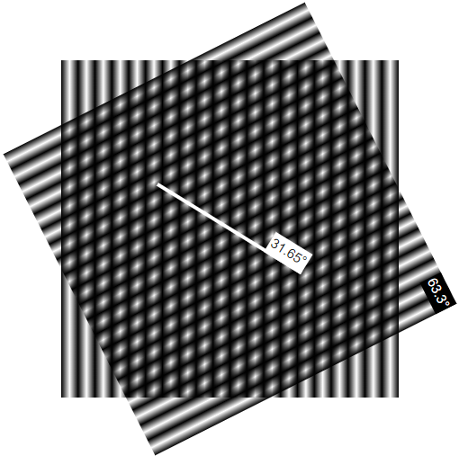

# zima7316_9103_tut6

### **Imaging Technique:**

The *moire effect* is an optical interference phenomenon that occurs when two regular lines or patterns overlap. This dynamic visual effect provides a rich visual experience that can be achieved with just simple lines or patterns. The visual effect will change when the angle, spacing, or positioning of two or more patterns are adjusted slightly.

Considering the style of Nasreen Mohamedi's 'untitled-1', where she uses lines to express her artistic views, the moire effect complements her artistic style. Using the moire effect showcases her unique line style and brings more dynamism, depth, and interactivity to these lines.

#### Example1

#### Example2

### **Coding Technique:**

Create a continuous linear gradient pattern using *repeating-linear-gradient*. Different line or speckle patterns can be obtained by changing the colour, angle, and spacing. When two similar or identical patterns overlap, the moire effect occurs. This effect arises from the slight differences between the two patterns, amplifying their interference.

Furthermore, by utilizing code, the transform property can be modified to allow dynamic movement or rotation of the patterns. Combining interaction (such as mouse movement) can obtain richer dynamic effects, enhancing the dynamism and interactivity of moire pattern.

[Example](https://codepen.io/LukeFixt/pen/VLQVWJ)

